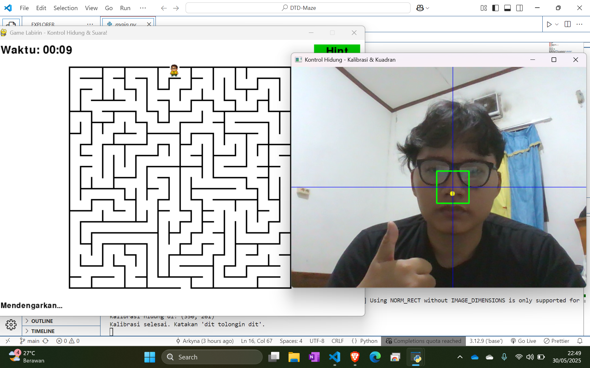

# Dit Tolongin Dit Maze

Sebuah proyek interaktif berbasis Python untuk mata kuliah **IF4021 - Sistem/Teknologi Multimedia**
Semester Genap 2024/2025

---

## 🧠 Deskripsi Proyek

**Dit Tolongin Dit Maze** adalah game interaktif yang menggabungkan **pelacakan wajah real-time**, **perintah suara**, dan **gameplay labirin**. Pemain mengarahkan karakter **Denis** melalui labirin dengan gerakan wajah (terutama hidung), dan dapat meminta bantuan dengan suara jika kesulitan.

🎧 Ucapkan:

> “**dit tolongin dit**”
> Untuk menampilkan **hint** visual yang mempermudah navigasi.

### 🔥 Fitur Unggulan

* 🎯 **Face Tracking** dengan **MediaPipe**: deteksi posisi hidung secara real-time
* 🗣️ **Speech Recognition** dengan perintah suara bahasa Indonesia
* 🧱 **Maze Hint System** berbasis perintah
* 🎮 **Kontrol Non-Konvensional**: tidak butuh keyboard—cukup wajah dan suara
* 🖼️ **Overlay karakter Denis** yang mengikuti gerakan pemain

---

## 👨‍💻 Anggota Tim – *Dikit Lagi Selesai*

| Nama Lengkap            | NIM       | GitHub ID        |
| ----------------------- | --------- | ---------------- |
| Alwi Arfan Solin        | 122140197 | `@samanbrembo14` |
| Jhoel Robert Hutagalung | 122140174 | `@arkyna`        |
| Andre Tampubolon        | 122140194 | `@dreeept`       |


---

## 📅 Logbook Mingguan

| Minggu | Kegiatan                                                        |
| ------ | --------------------------------------------------------------- |
| 1      | Percobaan Landmarking menggunakan MediaPIPE |
| 2      | Mencari Asset buat program |
| 3      | Percobaan Kode dengan pendekatan masing-masing |
| 4      | Penyelesaian Projek + Membuat laporan |

---

## 🚀 Cara Menjalankan Proyek

### 1. Clone repositori ini

```bash
git clone https://github.com/Arkyna/DTD-Maze.git
cd DTD-Maze
```

### 2. Buat virtual environment (opsional tapi disarankan)

```bash
python -m venv DTD-Venv
source venv/bin/activate        # Linux/macOS
venv\Scripts\activate.bat       # Windows
```

### 3. Install dependensi

```bash
pip install -r requirements.txt
```

### 4. Jalankan game

```bash
python main.py
```

---

## 📦 Dependencies

Berikut dependensi minimal yang dibutuhkan, sudah tersedia di `requirements.txt`:

```txt
pygame
opencv-python
mediapipe
SpeechRecognition (Menggunakan API google, sebaiknya sediakan koneksi internet yang stabil)
pyaudio
```

> ⚠️ **Catatan**:
>
> * Pastikan device Anda memiliki **mikrofon** dan **kamera** yang aktif
> * Untuk Windows: jika `pyaudio` gagal di-install, gunakan `pipwin`:
>
>   ```bash
>   pip install pipwin
>   pipwin install pyaudio
>   ```

---

## 🎯 Tujuan Pembelajaran

Proyek ini melatih kemampuan dalam:

* Implementasi multimedia interaktif (audio + visual input)
* Pengolahan sinyal video dan suara real-time
* Integrasi pustaka pihak ketiga dalam Python (OpenCV, MediaPipe, SpeechRecognition)
* Pengembangan aplikasi game berbasis interaksi alami manusia-komputer

---

## 🧠 Lisensi

Proyek ini dikembangkan untuk kepentingan akademis.
Distribusi atau penggunaan ulang bebas

---

## 💬 Kontak

Untuk pertanyaan atau kolaborasi, silakan hubungi salah satu anggota tim melalui GitHub.
